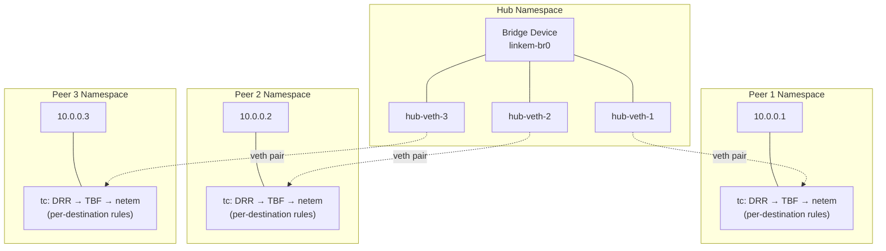

## Introduction

When we started working on [`msg-rs`](https://github.com/chainbound/msg-rs) we
ran into the necessity of emulating real networks with latency, jitter, packet
loss, and bandwidth constraints. We needed a way to test under realistic
conditions without setting up actual distributed infrastructure.

**Linkem** is what we ended up building. It's a Rust library that creates
isolated network peers using Linux namespaces and injects network impairments
between them, fully leveraging the kernel TCP/IP stack for modelling traffic.
This article documents how it works and the decisions we made along the way.

## Existing Tools and the Gap

Before building something new, we looked at what already existed. Network
emulation is a solved problem in many contexts, depending on your requirements.

**tc** is the foundation everything else builds on. The Linux kernel's traffic
control subsystem can add delay, loss, bandwidth limits, and more to any network
interface. The problem is that it operates at the system level. You run `tc`
commands to modify interfaces, and those changes affect everything using that
interface. There's no isolation between tests, no easy way to create multi-peer
topologies, and integrating it into a Rust test suite means shelling out to
external commands.

[**Mininet**](https://github.com/mininet/mininet) and its fork
[**Containernet**](https://containernet.github.io/) are Python-based network
emulators popular in SDN research. They can create complex topologies with
switches, routers, and hosts. Containernet extends this to use Docker containers
as hosts. These are powerful tools, but they require defining your topology
upfront in Python, spinning up the emulated network, and then running your tests
inside it. The workflow is "create topology first, then run code inside" — the
opposite of what we wanted for Rust integration tests.

[**Toxiproxy**](https://github.com/Shopify/toxiproxy) from Shopify takes a
different approach: it's a TCP proxy that sits between your application and its
dependencies. You configure "toxics" (latency, timeouts, bandwidth limits) via a
REST API. It's great for testing how your app handles a flaky database
connection, but it's not network emulation — it's application-layer proxying.
Your code has to connect through the proxy, which means changing connection
strings. It also can't simulate things like packet loss at the IP level or test
UDP-based protocols.

[**Estimator**](https://github.com/commonwarexyz/monorepo/tree/main/examples/estimator)
from Commonware is a great tool for testing prototypes of consensus protocols,
simulating peers distributed across specified AWS regions with real-world
latency/jitter in virtual time. It features a handy DSL to create different
scenarios and replay them deterministically. Its main downside is the limited
scope: it's designed for consensus protocols, not general-purpose network
testing.

[**Pumba**](https://github.com/alexei-led/pumba) is a chaos testing tool for
Docker containers. It can kill containers, pause them, or use `tc` to inject
network faults. But it operates on running containers from the outside — you
define your Docker Compose setup, start it, then point Pumba at containers to
disrupt. Like Containernet, the topology exists before your test code runs.

[**netsim**](https://github.com/canndrew/netsim) is the closest to what we
needed. It's a Rust library that uses Linux namespaces to isolate network stacks
and lets you run async code inside them. However, it doesn't provide the
per-destination impairment control we needed. When Peer A sends to Peer B versus
Peer C, we wanted different latency and loss characteristics — netsim's model
didn't support that out of the box.

### Using the Kernel’s TCP/IP stack

There's another issue with most of these tools: they operate at different layers
of the stack and aren't true kernel-level network emulation. This matters when
you want to test things like:

- _TCP buffer tuning_ (`tcp_rmem`, `tcp_wmem`) — how do different buffer sizes
  affect throughput on high-latency links?
- _Window scaling_ — is your system correctly configured for leveraging TCP
  window scaling on high bandwidth-delay product links?
- _Congestion control algorithms_ — how does BBR compare to CUBIC under packet
  loss?

You can't answer these questions with application-layer proxies. The traffic
never goes through the real kernel networking stack in a meaningful way. What we
wanted was an environment as realistic as possible, where the kernel's TCP
implementation, buffer management, and congestion control are all part of the
test.

<Callout type="info">
  To recap, existing tools either they require external setup (Docker, Python
  scripts, CLI wrappers), they model a single degraded link rather than a
  topology with per-peer-pair impairments, or they don't operate at the kernel
  level. For e2e tests and benchmarks where you want real kernel networking
  behavior, there wasn't an obvious solution.
</Callout>

## Usage

The core abstraction is simple: create a network, add peers, define impairments
between them, and run async code inside each peer's isolated namespace.

Add the library to your project:

```bash
cargo add linkem
```

And then model your network with it!

```rust
use linkem::*;
use std::net::{IpAddr, Ipv4Addr, SocketAddr};

#[tokio::main]
async fn main() -> eyre::Result<()> {
    let subnet = Subnet::new(IpAddr::V4(Ipv4Addr::new(10, 100, 0, 0)), 16);
    let mut network = Network::new(subnet).await?;

    // Add peers, each gets its own network namespace and IP
    let frankfurt = network.add_peer().await?;
    let tokyo = network.add_peer().await?;
    let new_york = network.add_peer().await?;

    // Define realistic cross-region conditions
    network.apply_impairment(
        Link(frankfurt, tokyo),
        LinkImpairment::new()
            .latency_ms(120)
            .jitter_ms(5)
            .loss_percent(0.1)
    ).await?;

    network.apply_impairment(
        Link(frankfurt, new_york),
        LinkImpairment::new()
            .latency_ms(40)
            .bandwidth_mbit(100.0)
    ).await?;

    // Run your distributed system
    network.run_in_namespace(frankfurt, || async {
        // This code sees frankfurt's network stack.
        // Connections to tokyo experience 120ms latency.
        // Connections to new_york experience 40ms latency.
        start_consensus_node(config).await
    }).await?;

    // ... Start other nodes as well
}
```

Impairments are directional and per-link. Frankfurt to Tokyo can have different
characteristics than Tokyo to Frankfurt. You can model asymmetric links,
regional variations, or specific failure scenarios.

### Testing Distributed Systems

You can reproduce specific scenarios from production by replaying with
comparable request volumes and network conditions, then iterate quickly on
improvements. You can also verify message delivery guarantees before deploying
to a live environment:

- _At-least-once delivery_: ensure consumers are idempotent and can safely
  handle duplicates.
- _At-most-once delivery_: confirm messages are not retried unexpectedly under
  transient failures.
- _Ordering guarantees_: observe how your system behaves when messages arrive
  late or out of order.
- _Eventual consistency_: verify convergence after partitions heal or delayed
  messages are delivered.

### Chaos Testing

Impairments are dynamic, as you can change them at runtime without recreating
the network:

```rust
// Start with good conditions
network.apply_impairment(Link(a, b), LinkImpairment::default()).await?;

// Degrade the link mid-test
tokio::time::sleep(Duration::from_secs(10)).await;
network.apply_impairment(
    Link(a, b),
    LinkImpairment::new().latency_ms(500).loss_percent(10.0)
).await?;

// Restore it
tokio::time::sleep(Duration::from_secs(10)).await;
network.apply_impairment(Link(a, b), LinkImpairment::default()).await?;
```

This lets you test how your system responds to transient network issues,
degradation during operation, or recovery from failures.

### Case Study: Bandwidth-Delay Product and TCP Tuning

One example that shows why kernel-level emulation matters: testing TCP
throughput on high-latency links.

TCP throughput is fundamentally limited by the
[bandwidth-delay product](https://en.wikipedia.org/wiki/Bandwidth-delay_product)
(BDP), which we’ve grappled with in a
[previous post](https://engineering.chainbound.io/flowproxy-approaching-optimality#kernel-parameter-tuning).
On a 10 Mbit/s link with 40ms RTT, the BDP is about 50 KB. If TCP's receive
window is smaller than the BDP, you can't fill the pipe — you'll get less
throughput than the link can handle.

The advertised default receive window starts small and grows dynamically via TCP
receive buffer autotuning, bounded by `tcp_rmem` and `rmem_max`, and may exceed
64 KB only if window scaling is enabled. This is controlled by kernel
parameters: `tcp_window_scaling` enables the feature, and `tcp_rmem` sets the
buffer sizes.

With `linkem`, we can actually play around with these settings. Set up a 10
Mbit/s link with 40ms RTT, then:

1. **Disable window scaling, use 64 KB max buffer**: Transfer throughput is
   limited — TCP can't keep enough data in flight to fill the pipe.

   ```rust
   network
       .run_in_namespace(receiver, |_| {
           Box::pin(async {
               // Disable window scaling
               std::fs::write("/proc/sys/net/ipv4/tcp_window_scaling", "0").unwrap();
               // max 64KB
               std::fs::write("/proc/sys/net/ipv4/tcp_rmem", "4096 16384 65535").unwrap();
           })
       })
       .await?
       .await?;
   ```

2. **Enable window scaling, use 4 MB max buffer**: Throughput jumps
   significantly, approaching the link's capacity.

   ```rust
   network
       .run_in_namespace(receiver, |_| {
           Box::pin(async {
               // Enable window scaling
               std::fs::write("/proc/sys/net/ipv4/tcp_window_scaling", "1").unwrap();
               // max 4MB
               std::fs::write("/proc/sys/net/ipv4/tcp_rmem", "4096 262144 4194304").unwrap();
           })
       })
       .await?
       .await?;
   ```

[In this example](https://github.com/chainbound/msg-rs/blob/main/linkem/examples/bdp_throughput.rs),
you can see the difference in measured throughput. And the test runs against the
real Linux TCP stack, with real kernel buffer management. You can tune
`tcp_rmem` in one namespace without affecting others, given each namespace has
isolated `sysctl` parameters.

```
     Running `/Users/birb/oss/msg-rs/target/debug/examples/bdp_throughput`

=== BDP Throughput Demo ===

Link: 10 Mbit/s, 40 ms RTT, BDP = 50 KB
Transfer: 20 messages × 256 KB = 5 MB

Test 1: Window scaling OFF, max rwnd = 64 KB
Transfer elapsed: 6.715359154s
  Throughput: 6.2 Mbit/s (62%)

Test 2: Window scaling ON, max rwnd = 4 MB
Transfer elapsed: 4.609455782s
  Throughput: 9.1 Mbit/s (91%)

Window scaling + larger buffers improved throughput by 46%!
```

## How It Works

Under the hood, Linkem creates a hub-and-spoke network topology using Linux
namespaces:



Each peer lives in its own network namespace with a virtual ethernet pair
connecting it to a central bridge. Traffic control rules on each peer's
interface apply impairments based on destination IP — so Peer 1 can have
different latency to Peer 2 versus Peer 3.

The `tc` configuration uses a hierarchy of queue disciplines (qdiscs):

- _DRR (Deficit Round Robin)_: the root qdisc that classifies packets by
  destination IP, routing each flow to its own class
- _TBF (Token Bucket Filter)_: enforces bandwidth limits using a token bucket
  algorithm
- _netem_: adds delay, jitter, packet loss, and duplication

This is all managed through direct netlink socket communication — no shelling
out to `tc` commands.

### Previous implementation

The current `linkem` is actually a rewrite. The first version was a wrapper
around `tc` and `ip` shell commands — it could create namespaces and apply
impairments, but the implementation was brittle. Shelling out meant parsing text
output and debugging failures through command-line error messages. The code was
hard to extend and the developer experience suffered.

That version also supported macOS via `pfctl` and `dnctl` (the BSD packet filter
and dummynet). While cross-platform support sounds nice, maintaining two
completely different implementations with different capabilities split our
focus. Neither platform got the attention it needed.

For the rewrite, we made two key decisions: Linux-only, and direct netlink
communication. Dropping macOS let us focus on one platform and ship something
more polished. Using netlink instead of shell commands gave us programmatic
control over the kernel's networking stack. We build on the
[`rtnetlink`](https://docs.rs/rtnetlink) crate for standard operations and
construct custom netlink messages where needed. The result is more modular,
easier to debug, and a software for which we have more awareness and control.

## Impairment Options

Each link can be configured with:

| Parameter   | Unit      | Description                            |
| ----------- | --------- | -------------------------------------- |
| `latency`   | ms        | Base propagation delay                 |
| `jitter`    | ms        | Random variation added to latency      |
| `loss`      | % (0-100) | Packet loss percentage                 |
| `duplicate` | % (0-100) | Packet duplication percentage          |
| `bandwidth` | Mbit/s    | Rate limit                             |
| `burst`     | KiB       | Burst allowance for bandwidth limiting |

Latency and jitter model propagation delay i.e., the time it takes packets to
travel the link. Bandwidth limiting models link capacity with a token bucket
filter. These can be combined to simulate various network conditions: a
satellite link (high latency, moderate bandwidth), a congested datacenter link
(low latency, bandwidth constrained), or a flaky mobile connection (variable
latency, packet loss).

## Limitations

- **Linux only.** The implementation uses namespaces, netlink, and tc. No macOS
  or Windows support planned for now.

- **Root required.** Creating and mounting namespaces `CAP_NET_ADMIN` and
  `CAP_SYS_ADMIN`

## Closing Notes

`linkem` is still in alpha — the API and ergonomics are evolving as we use it
ourselves and learn what works best. If you're building distributed systems in
Rust and need realistic network testing, we'd love for you to try it out.

We're especially interested in feedback on:

- **API ergonomics**: Is the interface intuitive? What would make it easier to
  use?
- **Compatibility**: We've tested on a limited set of kernel versions and
  distributions. If you run into issues on your setup, let us know: edge cases
  with different kernels, or minimal Linux environments are exactly what we need
  to hear about.

Check out the [API documentation](https://docs.rs/linkem) or open an issue on
the [GitHub repo](https://github.com/chainbound/msg-rs). Suggestions, bug
reports, and contributions are all welcome.
